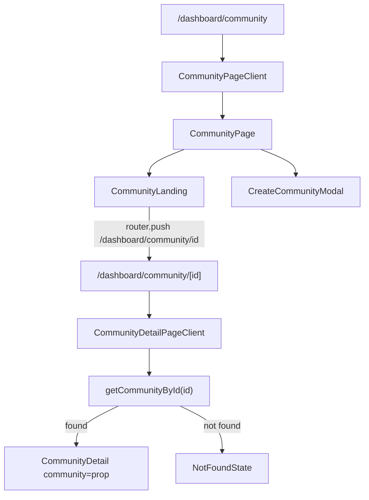

# Design Document: Dynamic Community Pages

## Overview

This feature replaces the current modal-based community detail view with dedicated dynamic routes. Each community gets a permanent URL at `/dashboard/community/[id]`, making communities shareable and bookmarkable. The `CommunityLanding` at `/dashboard/community` remains unchanged in appearance; clicking a card now triggers `router.push` instead of a store selection. The `CommunityDetail` component is decoupled from the store's `selectedCommunity` and instead accepts a `community` prop, enabling it to render correctly on direct URL access without prior store hydration.

## Architecture



### Key Architectural Decisions

- **CommunityDetail becomes prop-driven**: The component currently reads `selectedCommunity` from the store. It will be refactored to accept `community: Community` as a prop. The store's `selectedCommunity` is no longer the source of truth for the detail view.
- **Store actions remain**: `joinCommunity`, `acceptRequest`, `declineRequest` stay in the store. The detail page reads the community from the store by ID after mutations so the UI stays reactive.
- **Tab state lives in the URL**: The `?tab=` query param drives the active tab on initial render. Tab switches call `router.replace` to update the URL without polluting history.
- **Data layer is synchronous (mock)**: `getCommunityById` is a pure lookup against `MOCK_COMMUNITIES`. No async loading is needed now; the loading state is a brief client-side render cycle handled with a `useState` guard.

## Components and Interfaces

### New: `src/app/dashboard/community/[id]/page.tsx`

Next.js dynamic route page. Reads `params.id` and `searchParams.tab`, resolves community data, and renders either `CommunityDetail` or a not-found state.

```ts
// Props injected by Next.js App Router
interface PageProps {
  params: { id: string };
  searchParams: { tab?: string };
}
```

This is a Server Component that passes resolved data down to a client wrapper.

### New: `src/app/dashboard/community/[id]/CommunityDetailPageClient.tsx`

Client component wrapper that owns the reactive tab state and share action. Receives `community: Community` and `initialTab: CommunityTab` as props.

```ts
interface CommunityDetailPageClientProps {
  community: Community;
  initialTab: CommunityTab;
}
```

### Modified: `src/components/community/CommunityDetail.tsx`

Refactored to accept `community` as a prop instead of reading from the store. Tab state is lifted to the parent (`CommunityDetailPageClient`).

```ts
interface CommunityDetailProps {
  community: Community;
  activeTab: CommunityTab;
  onTabChange: (tab: CommunityTab) => void;
  onBack: () => void;
  onShare: () => void;
}
```

The store is still used for mutations (`joinCommunity`, `acceptRequest`, `declineRequest`), but the community data displayed is the prop value, kept in sync via the store's reactive updates.

### Modified: `src/components/community/CommunityLanding.tsx`

Replace `selectCommunity` call with `router.push('/dashboard/community/' + c.id)`. The `CreateCommunityModal` stays here.

### Modified: `src/components/community/CommunityCard.tsx`

Rename `onJoin` prop to `onNavigate` to better reflect the new intent.

```ts
interface CommunityCardProps {
  community: Community;
  onNavigate: (c: Community) => void;
}
```

### Modified: `src/components/community/CommunityPage.tsx`

Remove the `selectedCommunity ? <CommunityDetail /> : <CommunityLanding />` conditional. Render only `<CommunityLanding />` and `<CreateCommunityModal />`.

### New: `src/lib/community.ts`

```ts
export function getCommunityById(id: string): Community | undefined
export function isValidCommunityTab(tab: string): tab is CommunityTab
```

`getCommunityById` looks up `MOCK_COMMUNITIES` by `id`. `isValidCommunityTab` validates the `?tab=` query param.

## Data Models

No new types are introduced. Existing types from `src/types/community.ts` are used as-is:

```ts
type CommunityRole = 'guest' | 'member' | 'admin';
type CommunityTab = 'announcements' | 'live-classes' | 'live-series' | 'resources' | 'members';

interface Community {
  id: string;
  name: string;
  description: string;
  thumbnail: string;
  memberCount: string;
  eventCount: number;
  memberAvatars: string[];
  role: CommunityRole;
  announcements: Announcement[];
  members: CommunityMember[];
  joinRequests: CommunityMember[];
}
```

The `role` field on `Community` is the source of truth for access control. The detail page reads it directly from the resolved community object.

### Tab Resolution Logic

```
resolveTab(param: string | undefined): CommunityTab
  if param is undefined → 'announcements'
  if isValidCommunityTab(param) → param
  else → 'announcements'
```

### Store Mutation Reactivity

After `joinCommunity(id)` is called, the store updates `selectedCommunity.role`. The detail page client component reads the community from the store by ID (falling back to the prop) so the role change is reflected immediately without a page reload.

## Correctness Properties

*A property is a characteristic or behavior that should hold true across all valid executions of a system — essentially, a formal statement about what the system should do. Properties serve as the bridge between human-readable specifications and machine-verifiable correctness guarantees.*

### Property 1: Route resolves community by ID

*For any* community ID present in `MOCK_COMMUNITIES`, rendering the dynamic route page with that ID should display the community whose `id` field matches, regardless of the store's `selectedCommunity` state.

**Validates: Requirements 1.1, 1.2, 4.1, 4.4**

### Property 2: Card click navigates to correct route

*For any* community in the landing grid, clicking its card should invoke `router.push` with the path `/dashboard/community/[community.id]`.

**Validates: Requirements 2.1**

### Property 3: Back button navigates to landing

*For any* rendered `CommunityDetail`, activating the back control should invoke `router.push` with `/dashboard/community`.

**Validates: Requirements 3.1, 3.2**

### Property 4: Tab param drives initial active tab

*For any* valid `CommunityTab` value passed as the `?tab=` query parameter, the community detail page should render with that tab active on initial render.

**Validates: Requirements 5.2**

### Property 5: Invalid tab param falls back to announcements

*For any* string that is not a valid `CommunityTab`, passing it as `?tab=` should result in the `announcements` tab being active.

**Validates: Requirements 5.3**

### Property 6: Share action copies full absolute URL to clipboard

*For any* community detail page, activating the share action should call the clipboard API with the full absolute URL (`window.location.href`) of the current page.

**Validates: Requirements 6.1, 6.3**

### Property 7: Hero CTA reflects user role

*For any* community, if `role === 'guest'` the hero section should display a "Request to join" button; if `role === 'member'` or `role === 'admin'` it should display a membership status indicator instead.

**Validates: Requirements 7.2, 7.3**

### Property 8: Tab content access matches role

*For any* community and any tab in `['announcements', 'live-classes', 'live-series', 'resources']`, if `role === 'guest'` the tab content should be replaced by `LockedOverlay`; if `role === 'member'` or `role === 'admin'` the full content should render without `LockedOverlay`.

**Validates: Requirements 7.4, 7.5**

### Property 9: Members tab visibility matches admin role

*For any* community, the `Members` tab should appear in the tab list if and only if `role === 'admin'`.

**Validates: Requirements 7.6, 7.7**

### Property 10: Join request updates role to member

*For any* community where `role === 'guest'`, calling `joinCommunity(id)` on the store should result in that community's `role` becoming `'member'`.

**Validates: Requirements 8.1**

### Property 11: Accept request moves member from joinRequests to members

*For any* community and any member ID present in `joinRequests`, calling `acceptRequest(communityId, memberId)` should remove that entry from `joinRequests` and add it to `members`.

**Validates: Requirements 8.4**

### Property 12: Decline request removes from joinRequests only

*For any* community and any member ID present in `joinRequests`, calling `declineRequest(communityId, memberId)` should remove that entry from `joinRequests` and leave `members` unchanged.

**Validates: Requirements 8.5**

### Property 13: Pending requests indicator matches joinRequests length

*For any* community where `role === 'admin'` and `joinRequests.length > 0`, the Requests sub-tab should display a visual indicator; when `joinRequests.length === 0`, no indicator should be present.

**Validates: Requirements 8.6**

## Error Handling

| Scenario | Handling |
|---|---|
| Unknown community ID in URL | Render inline "Community not found" message with a link to `/dashboard/community`. No redirect, no 404 page. |
| Invalid `?tab=` param | Silently fall back to `announcements` tab. |
| Clipboard API unavailable | Catch the rejection; skip the "Copied!" confirmation. No error shown to user. |
| Store mutation on wrong community ID | Store actions guard by checking `selectedCommunity?.id === communityId`; no-op if mismatch. |

## Testing Strategy

### Unit Tests

Focus on specific examples, edge cases, and integration points:

- `getCommunityById` returns the correct community for a known ID and `undefined` for an unknown ID.
- `isValidCommunityTab` returns `true` for all five valid tab values and `false` for arbitrary strings.
- `resolveTab` returns `'announcements'` when given `undefined` or an invalid string, and the tab value when given a valid one.
- `CommunityDetail` renders a back button when given a community prop.
- `CommunityDetail` renders "No pending requests." when `joinRequests` is empty.
- The dynamic route page renders the not-found state when `getCommunityById` returns `undefined`.
- The dynamic route page renders a loading state before community data is resolved.
- Share button shows "Copied!" confirmation after being clicked.
- Default tab is `announcements` when no `?tab=` param is present.

### Property-Based Tests

Use a property-based testing library (e.g., `fast-check` for TypeScript/Jest) with a minimum of 100 iterations per property.

Each test must include a comment referencing the design property it validates, using the format:
`// Feature: dynamic-community-pages, Property N: <property_text>`

**Properties to implement as PBT tests:**

- **Property 1** — Generate random community IDs from `MOCK_COMMUNITIES`, render the page with store `selectedCommunity = null`, assert the correct community name is displayed.
- **Property 2** — Generate random communities, render `CommunityLanding`, click a card, assert `router.push` was called with `/dashboard/community/${community.id}`.
- **Property 3** — Generate random communities, render `CommunityDetail`, click back, assert `router.push('/dashboard/community')`.
- **Property 4** — Generate random valid `CommunityTab` values, render the page with `?tab=<value>`, assert that tab is active.
- **Property 5** — Generate random strings that are not valid `CommunityTab` values, assert `resolveTab` returns `'announcements'`.
- **Property 6** — Generate random community IDs, render the detail page, click share, assert `navigator.clipboard.writeText` was called with `window.location.href`.
- **Property 7** — Generate random communities with each role value, render `CommunityDetail`, assert hero CTA matches role.
- **Property 8** — Generate random communities with `role = 'guest'`, render each restricted tab, assert `LockedOverlay` is present; repeat with `role = 'member'`, assert it is absent.
- **Property 9** — Generate random communities with each role, render `CommunityDetail`, assert Members tab presence matches `role === 'admin'`.
- **Property 10** — Generate random community IDs from mock data with `role = 'guest'`, call `joinCommunity`, assert role becomes `'member'`.
- **Property 11** — Generate random communities with non-empty `joinRequests`, call `acceptRequest` for a random member, assert member moved correctly.
- **Property 12** — Generate random communities with non-empty `joinRequests`, call `declineRequest` for a random member, assert member removed from `joinRequests` and `members` unchanged.
- **Property 13** — Generate random communities with varying `joinRequests` lengths, render the Members tab as admin, assert indicator presence matches `joinRequests.length > 0`.
